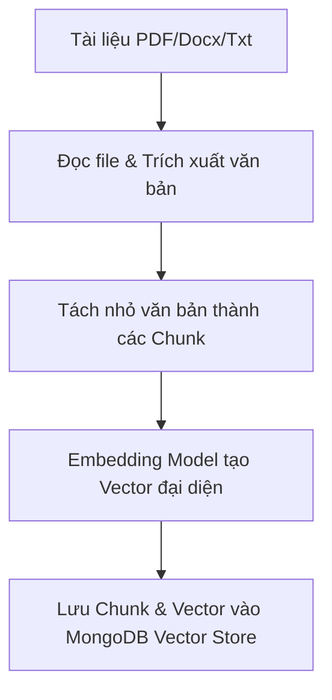
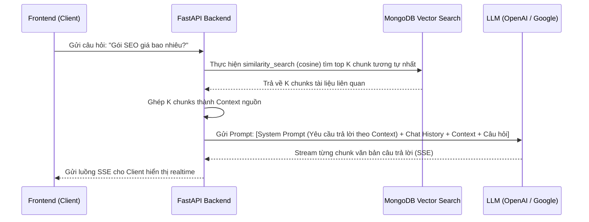

# Tóm tắt Lý thuyết & Nguyên lý hoạt động (Frontend & RAG Backend)

Tài liệu này hệ thống hóa toàn bộ lý thuyết cốt lõi, nguyên lý hoạt động và các công nghệ chính được áp dụng trong dự án, chia thành hai phần chính: **Frontend (React Hooks)** và **Backend (RAG & Giao thức truyền tải)**.

---

## PHẦN 1: LÝ THUYẾT & NGUYÊN LÝ HOẠT ĐỘNG FRONTEND (REACT HOOKS)

React là thư viện xây dựng giao diện dựa trên **Component**. Để quản lý trạng thái (state) và các tác vụ bất đồng bộ (side effects) trong Functional Components, React cung cấp các **Hooks**. Dưới đây là các hook cốt lõi được sử dụng trong dự án kèm ví dụ minh họa:

### 1. `useState` (Quản lý trạng thái)
* **Khái niệm:** Cho phép component lưu trữ và cập nhật dữ liệu động. Khi state thay đổi, React sẽ tự động vẽ lại (re-render) component để cập nhật giao diện.
* **Cú pháp:** `const [state, setState] = useState(initialValue);`
* **Ví dụ áp dụng (`ChatWidget.jsx`):**
  * Để lưu trữ nội dung người dùng nhập vào ô nhập câu hỏi:
    ```jsx
    // 1. Khai báo state "input" mặc định là chuỗi rỗng
    const [input, setInput] = useState('');

    // 2. Gắn vào thẻ HTML <input>
    <input 
      value={input} 
      onChange={(event) => setInput(event.target.value)} 
    />

    // 3. Khi bấm gửi, reset lại ô nhập
    setInput('');
    ```

### 2. `useEffect` (Quản lý Side Effects)
* **Khái niệm:** Thực hiện các tác vụ bên ngoài tầm kiểm soát của React như: gọi API, lắng nghe sự kiện từ trình duyệt, thao tác với LocalStorage, hoặc dọn dẹp bộ nhớ (cleanup).
* **Cơ chế chạy phụ thuộc vào Dependency Array `[...]`:**
  * `useEffect(() => {...}, [messages])`: Chỉ chạy khi mảng `messages` thay đổi.
  * `useEffect(() => {...}, [])`: Chỉ chạy duy nhất **một lần** sau khi component hiển thị lần đầu tiên (mount).
* **Ví dụ áp dụng (`ChatWidget.jsx`):**
  * **Tác vụ 1: Tự động cuộn xuống cuối khi có tin nhắn mới:**
    ```jsx
    const messagesEndRef = useRef(null);

    useEffect(() => {
        // Tác vụ này chạy tự động mỗi khi danh sách tin nhắn "messages" thay đổi
        messagesEndRef.current?.scrollIntoView({ behavior: 'smooth' });
    }, [messages]);
    ```
  * **Tác vụ 2: Hủy luồng stream khi đóng khung chat (Cleanup):**
    ```jsx
    const abortRef = useRef(null);

    useEffect(() => {
        // Hàm return trong useEffect sẽ chạy khi component bị hủy (unmount)
        return () => {
            abortRef.current?.abort(); // Hủy request API đang stream dở
        };
    }, []); // Dependency rỗng nghĩa là chỉ chạy cleanup khi đóng widget
    ```

### 3. `useMemo` (Tối ưu hóa hiệu năng)
* **Khái niệm:** Ghi nhớ (cache) kết quả tính toán của một hàm. Kết quả chỉ được tính toán lại khi một trong các giá trị phụ thuộc thay đổi. Giúp tránh việc tính toán lại không cần thiết.
* **Ví dụ áp dụng (`ChatWidget.jsx`):**
  * Để tạo danh sách tin nhắn chào mừng theo tên người dùng, nếu sử dụng hàm thông thường, mỗi lần gõ phím (render lại) sẽ tạo lại tin nhắn chào mừng mới. `useMemo` giải quyết việc này:
    ```jsx
    const initialMessages = useMemo(() => {
        return [
            {
                id: 'welcome-1',
                role: 'bot',
                text: `Xin chào ${user?.name ?? 'bạn'}, mình là trợ lý AI...`,
                sources: []
            }
        ];
    }, [user?.name]); // Chỉ tính toán lại tin nhắn này khi tên user thay đổi
    ```

### 4. `useRef` (Tham chiếu phần tử DOM và lưu trữ biến tĩnh)
* **Khái niệm:** 
  1. Tạo tham chiếu trực tiếp đến một phần tử DOM trong HTML.
  2. Lưu trữ một biến có thể thay đổi giá trị mà **không làm component bị re-render** khi giá trị đó thay đổi.
* **Ví dụ áp dụng (`ChatWidget.jsx`):**
  * **Trường hợp 1: Cuộn trang (DOM Reference):**
    ```jsx
    const messagesEndRef = useRef(null);

    // Gắn ref vào phần tử cuối danh sách
    <div ref={messagesEndRef} />
    ```
  * **Trường hợp 2: Lưu trữ đối tượng hủy API (`AbortController`):**
    ```jsx
    const abortRef = useRef(null);

    // Gán giá trị tĩnh bất cứ lúc nào mà không gây vẽ lại giao diện
    const abortController = new AbortController();
    abortRef.current = abortController;
    ```

---

## PHẦN 2: LÝ THUYẾT & NGUYÊN LÝ HOẠT ĐỘNG BACKEND (RAG & WEB API)

### 1. Kiến trúc RESTful API
Dự án sử dụng FastAPI để thiết kế RESTful API (Representational State Transfer) hoạt động trên giao thức HTTP:
* **Stateless (Không lưu trạng thái):** Mỗi request gửi lên server phải chứa đầy đủ thông tin xác thực. 
  * *Ví dụ:* Client gửi token JWT qua Header: `Authorization: Bearer <token_jwt_cua_ban>`. Server chỉ kiểm tra tính hợp lệ của token và xử lý dữ liệu, không lưu session của client trong bộ nhớ RAM của server.
* **HTTP Methods chuẩn hóa:**
  * `GET /api/chat/sessions`: Lấy danh sách lịch sử chat của user.
  * `POST /api/chat`: Tạo câu hỏi chat mới và nhận stream câu trả lời.
  * `DELETE /api/documents/{id}`: Admin thực hiện xóa tài liệu RAG.

### 2. Nguyên lý hoạt động của RAG (Retrieval-Augmented Generation)
RAG là kỹ thuật tích hợp thêm dữ liệu từ một kho tri thức bên ngoài vào Prompt trước khi gửi cho LLM (OpenAI/Google Gemini) sinh câu trả lời.

#### Giai đoạn 1: Nạp tài liệu (Ingestion Pipeline)

1. **Document Loading:** Đọc file tài liệu admin tải lên thông qua các thư viện loader (`PyPDFLoader`, `Docx2txtLoader`).
2. **Text Chunking:** Chia nhỏ văn bản lớn thành nhiều đoạn nhỏ (`CHUNK_SIZE = 1000` ký tự, độ chồng gối `CHUNK_OVERLAP = 200`).
3. **Vector Embedding:** Gửi văn bản của từng chunk qua mô hình Embedding (`text-embedding-3-small` hoặc Google AI) để chuyển văn bản thành chuỗi số vector (ví dụ: 1536 chiều).
4. **Vector Database:** Lưu trữ nội dung chunk kèm vector đại diện vào MongoDB Atlas Vector Search.

#### Giai đoạn 2: Chat hỏi đáp (Query & Generation Pipeline)


#### Chi tiết các công nghệ RAG sử dụng trực tiếp trong dự án:
* **Framework:** **LangChain** - thư viện chính để điều phối chuỗi xử lý (Chains), prompts và tích hợp các LLMs.
* **Document Loaders:**
  * `PyPDFLoader` (`langchain_community.document_loaders`): Đọc nội dung file PDF.
  * `Docx2txtLoader` (`langchain_community.document_loaders`): Đọc nội dung file DOCX.
  * `TextLoader` (`langchain_community.document_loaders`): Đọc file text thuần (`.txt`).
* **Text Splitter:** `RecursiveCharacterTextSplitter` chia nhỏ tài liệu dựa trên các ký tự xuống dòng hoặc khoảng trắng để không làm đứt đoạn ngữ nghĩa.
* **Embedding Models (Lớp vector hóa):**
  * `OpenAIEmbeddings` (mô hình `text-embedding-3-small` mặc định với 1536 chiều vector).
  * `GoogleGenerativeAIEmbeddings` (sử dụng API của Google để nhúng văn bản).
* **Vector Store:** **MongoDB Atlas Vector Search** (`MongoDBAtlasVectorSearch` của `langchain_mongodb`). Sử dụng thuật toán so khớp **Cosine Similarity** trên trường `embedding`.
* **LLM (Large Language Model):**
  * `ChatOpenAI` hoặc `ChatGoogleGenerativeAI` bật cờ `streaming=True` để có thể stream câu trả lời về phía client ngay lập tức.
* **LangChain Expression Language (LCEL):** Chuỗi thực thi RAG được cấu trúc ngắn gọn bằng toán tử pipe:
  ```python
  chain = prompt | llm
  ```

---

## PHẦN 3: GIAO THỨC TRUYỀN TẢI STREAMING (SERVER-SENT EVENTS - SSE)

Để tạo trải nghiệm chat mượt mà giống ChatGPT (chữ chạy ra đến đâu hiển thị đến đó), dự án sử dụng giao thức **Server-Sent Events (SSE)**.

### 1. So sánh các giải pháp giao tiếp Realtime

| Tiêu chí | REST API thường (Polling) | WebSockets | Server-Sent Events (SSE) |
| :--- | :--- | :--- | :--- |
| **Hướng truyền dữ liệu** | Client yêu cầu $\rightarrow$ Server trả về | Hai chiều (Bidirectional) | Một chiều từ Server $\rightarrow$ Client (Unidirectional) |
| **Giao thức mạng** | HTTP ngắn hạn | TCP dài hạn nâng cấp từ HTTP | HTTP dài hạn (`keep-alive`) |
| **Độ phức tạp** | Rất đơn giản | Khá phức tạp (cần quản lý kết nối) | Đơn giản, chạy trực tiếp trên HTTP |
| **Phù hợp nhất** | CRUD dữ liệu tĩnh | Chat nhiều người, game, tài chính | **AI Chat streaming, thông báo, live-feed** |

### 2. Cách thức hoạt động của SSE trong dự án
* **Header kết nối:** Backend trả về phản hồi với Header đặc biệt để báo hiệu dữ liệu dạng dòng sự kiện liên tục:
  ```http
  Content-Type: text/event-stream
  Cache-Control: no-cache
  Connection: keep-alive
  X-Accel-Buffering: no
  ```
* **Định dạng gói dữ liệu (Data Format):** Dữ liệu truyền đi dưới dạng text thuần, phân tách bằng dấu xuống dòng kép `\n\n`. Hỗ trợ đặt tên sự kiện (`event`):
  * **Text chunk thông thường:**
    ```text
    data: Xin chào, tôi có thể giúp
    
    data: gì cho bạn?
    ```
  * **Nguồn tham chiếu (tách riêng bằng event `sources`):**
    ```text
    event: sources
    data: [{"filename": "tai-lieu-seo.pdf", "page": 2}]
    ```
  * **Đóng luồng kết nối (event `done`):**
    ```text
    event: done
    data: [DONE]
    ```

* **Phía Frontend đọc stream:**
  Sử dụng hàm `fetch` tiêu chuẩn kết hợp với **Stream Reader**:
  ```javascript
  const response = await fetch('/api/chat', { ... });
  const reader = response.body.getReader();
  const decoder = new TextDecoder();
  
  while (true) {
      const { done, value } = await reader.read();
      if (done) break;
      const textChunk = decoder.decode(value); // Đọc ký tự dạng realtime
      // Cập nhật textChunk này trực tiếp lên giao diện (state)
  }
  ```

---

## PHẦN 4: SO SÁNH CƠ SỞ DỮ LIỆU SQL VS NOSQL & LÝ DO CHỌN MONGODB

### 1. Bảng So sánh SQL và NoSQL

| Tiêu chí | Cơ sở dữ liệu quan hệ (SQL) | Cơ sở dữ liệu phi quan hệ (NoSQL - Document) |
| :--- | :--- | :--- |
| **Đại diện tiêu biểu** | PostgreSQL, MySQL, SQL Server | **MongoDB**, Redis, Cassandra |
| **Mô hình dữ liệu** | Bảng (Tables) gồm các hàng (Rows) và cột (Columns). | Tài liệu (Documents - dạng JSON/BSON) chứa trong các Collection. |
| **Schema (Lược đồ)** | Cố định, nghiêm ngặt (Cần chạy migration khi đổi cấu trúc). | Linh hoạt (Schema-less), các document tự do định nghĩa cấu trúc riêng. |
| **Mối quan hệ** | Định nghĩa rõ ràng qua Khóa ngoại (Foreign Keys) và `JOIN`. | Không bắt buộc, dùng Embedded Documents (lồng nhau) hoặc Reference. |
| **Độ nhất quán** | Tuân thủ tiêu chuẩn **ACID** (Tính nguyên tố, Nhất quán, Cô lập, Bền vững). | Tuân thủ tiêu chuẩn **BASE** (Nhất quán sau cùng - Eventual Consistency). |
| **Khả năng mở rộng** | Mở rộng theo chiều dọc (Scale Up - tăng RAM, CPU của server). | Mở rộng theo chiều ngang (Scale Out - phân tán ra nhiều server/Sharding). |

### 2. Ví dụ cách tổ chức dữ liệu Chat Session

#### Cách 1: Thiết kế trong cơ sở dữ liệu SQL (Ví dụ PostgreSQL)
Cần tối thiểu **2 bảng** liên kết với nhau qua Khóa ngoại (Foreign Key) `session_id`:

**Bảng `chat_sessions`** (Lưu thông tin phiên chat):
| session_id (PK) | user_email | title | created_at |
| :--- | :--- | :--- | :--- |
| `sess-001` | user@test.com | Tư vấn SEO | 2026-05-28 |

**Bảng `chat_messages`** (Lưu chi tiết từng tin nhắn):
| message_id (PK) | session_id (FK) | role | content | created_at |
| :--- | :--- | :--- | :--- | :--- |
| `msg-101` | `sess-001` | `user` | Giá SEO bao nhiêu? | 2026-05-28 10:00:00 |
| `msg-102` | `sess-001` | `assistant` | Gói SEO chỉ từ 5 triệu... | 2026-05-28 10:00:05 |

> **Hạn chế:** Khi muốn lấy toàn bộ lịch sử chat, server bắt buộc phải thực hiện phép toán `JOIN` giữa 2 bảng, gây chậm hệ thống khi số lượng tin nhắn tăng cao.

#### Cách 2: Thiết kế trong cơ sở dữ liệu NoSQL (Ví dụ MongoDB trong dự án)
Tất cả thông tin của phiên chat được đóng gói gọn gàng trong **1 Document duy nhất** dưới định dạng JSON/BSON:

```json
{
  "_id": "60d5ec42f1b2c345688b4567",
  "session_id": "sess-001",
  "user_email": "user@test.com",
  "title": "Tư vấn SEO",
  "messages": [
    {
      "role": "user",
      "content": "Giá SEO bao nhiêu?"
    },
    {
      "role": "assistant",
      "content": "Gói SEO chỉ từ 5 triệu..."
    }
  ],
  "created_at": "2026-05-28T10:00:00Z"
}
```

> **Ưu thế:** Chỉ cần 1 truy vấn duy nhất để đọc toàn bộ lịch sử chat cực nhanh mà không cần JOIN dữ liệu.

### 3. Lý do chọn MongoDB (NoSQL) trong dự án
* **CMS linh hoạt:** Dữ liệu cấu hình website động (`SiteContent`, `Blog`, `ServicePackage`) thường xuyên có các trường dữ liệu tùy chỉnh mới. Lưu trữ document giúp lập trình viên thoải mái mở rộng cấu trúc mà không phải chạy migration DB phức tạp.
* **Tích hợp Atlas Vector Search:** MongoDB Atlas hỗ trợ trực tiếp lưu trữ vector embedding (dưới dạng mảng số thực) và chạy tìm kiếm vector (`similarity_search`) ngay trên cùng cơ sở dữ liệu lưu trữ lịch sử chat, loại bỏ nhu cầu sử dụng thêm một database vector rời như Pinecone, giúp đơn giản hóa kiến trúc ứng dụng.

---

## PHẦN 5: LẬP TRÌNH HƯỚNG ĐỐI TƯỢNG (OOP) TRONG CODEBASE

Backend của dự án được cấu trúc chặt chẽ dựa trên 4 nguyên lý của **Lập trình hướng đối tượng (OOP)**:

### 1. Tính đóng gói (Encapsulation)
* **Khái niệm:** Gom các thuộc tính và phương thức có liên quan vào một Class, đồng thời che giấu các xử lý kỹ thuật phức tạp bên dưới, chỉ cung cấp các hàm public ra bên ngoài.
* **Ví dụ trong dự án:**
  ```python
  # Lớp ChatUseCase đóng gói tất cả các xử lý nghiệp vụ liên quan đến Chat RAG
  class ChatUseCase:
      def __init__(self, repository):
          self.repository = repository  # Lưu trữ repository nội bộ
          
      async def stream_chat(self, question: str, session_id: str, email: str):
          # Logic bên dưới được che giấu:
          # Controller gọi stream_chat() không cần biết chi tiết logic tìm kiếm vector
          # hay kết nối API đến OpenAI/Gemini như thế nào.
          docs = self._find_relevant_documents(question)
          context = self._combine_docs(docs)
          return self._call_llm_stream(question, context)
  ```

### 2. Tính kế thừa (Inheritance)
* **Khái niệm:** Cho phép lớp con thừa hưởng lại các thuộc tính và phương thức từ một lớp cha, giúp tái sử dụng mã nguồn hiệu quả.
* **Ví dụ trong dự án:**
  ```python
  from pydantic import BaseModel

  # ChatRequest kế thừa lại toàn bộ các phương thức kiểm tra định dạng dữ liệu (validation) của BaseModel
  class ChatRequest(BaseModel):
      message: str
      session_id: str | None = None
  ```

### 3. Tính đa hình (Polymorphism)
* **Khái niệm:** Cho phép các đối tượng thuộc các lớp khác nhau phản hồi cùng một tên hàm nhưng thực thi khác nhau tùy thuộc vào đối tượng đang gọi.
* **Ví dụ trong dự án:**
  Cả `ChatOpenAI` và `ChatGoogleGenerativeAI` đều kế thừa từ lớp trừu tượng `BaseChatModel`. Chúng chia sẻ chung phương thức `.astream()` để stream chữ, nhưng bên dưới sẽ gửi request tới các server API khác nhau:
  ```python
  # Hàm khởi tạo trả về đối tượng LLM tùy biến theo cấu hình hệ thống
  def _get_llm():
      if settings.LLM_PROVIDER == "openai":
          return ChatOpenAI(model="gpt-4")
      else:
          return ChatGoogleGenerativeAI(model="gemini-1.5-pro")

  # Sử dụng tính đa hình:
  llm = _get_llm()
  # Bất kể llm là OpenAI hay Gemini, ta vẫn gọi chung phương thức .astream()
  async for chunk in llm.astream(prompt):
      yield chunk.content
  ```

### 4. Tính trừu tượng (Abstraction)
* **Khái niệm:** Tập trung vào các phương thức cốt lõi và ẩn đi các logic cấu hình kỹ thuật phức tạp bên dưới.
* **Ví dụ trong dự án:**
  Khi truy xuất tài liệu từ Vector Database, chúng ta không cần viết các câu lệnh kết nối driver, tạo chỉ mục hay tính toán độ tương đồng cosine phức tạp, mà chỉ cần gọi phương thức trừu tượng hóa:
  ```python
  store = get_vector_store()
  
  # Hàm similarity_search đã trừu tượng hóa toàn bộ câu lệnh tìm kiếm vector phức tạp bên dưới
  docs = store.similarity_search(question, k=4)
  ```
